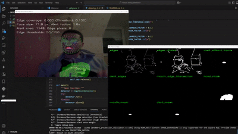

# Clothes Chewing Detection

A computer vision system that detects when I'm chewing on clothing (especially hoodie strings) and alerts me to stop the habit.



## The Problem

I developed a bad habit of putting clothes (especially hoodie strings) in my mouth while working in front of my computer. This both damages my clothes and is an unhygienic habit I wanted to break.

As a data scientist with experience in Python, I decided to build a solution using computer vision that could detect this behavior and alert me in real-time.

## How It Works

The system uses a webcam and multiple computer vision techniques to:

1. Detect my face and mouth region using MediaPipe Face Mesh
2. Track my hands using MediaPipe Hands
3. Detect edges/objects in my mouth area that aren't part of my hands
4. Alert me with a sound when it detects sustained mouth-object interaction

Rather than using complex deep learning for clothing detection (which proved to be slow and unreliable), I opted for a simpler and more effective approach using edge detection to identify foreign objects near my mouth.

## Technical Implementation

The system includes:

- **Face and mouth detection** using MediaPipe Face Mesh
- **Hand tracking** to exclude hands from detection (so I can touch my face normally)
- **Edge detection** using OpenCV's Canny algorithm to identify foreign objects
- **Alert zone** that scales dynamically based on face size
- **Time-based triggers** to avoid false positives
- **Visual debugging tools** to tune the system

## Requirements

- Python 3.6+
- OpenCV
- MediaPipe
- NumPy
- A webcam

## Installation

```bash
# Clone the repository
git clone https://github.com/khaledbouabdallah/Clothes-Chewing-Detection.git
cd hands-off-detector

# Install dependencies
pip install opencv-python mediapipe numpy
```

## Usage

```bash
python edge_mouth_detector.py
```

### Controls:

- **ESC**: Exit
- **+/-**: Increase/decrease sensitivity (threshold)
- **E/Q**: Increase/decrease edge detection (low threshold)
- **R/F**: Increase/decrease edge detection (high threshold)
- **A/Z**: Increase/decrease alert area margin
- **D**: Toggle debug mode

## Development Journey

This project went through several iterations:

1. First attempted using a hoodie-specific segmentation model, but it was too slow and inaccurate
2. Tried using color/skin detection to identify foreign objects, but faced too many false positives
3. Settled on edge detection which proved reliable for identifying string-like objects
4. Added alert zone scaling to handle different distances from camera
5. Tuned parameters for better sensitivity and reliability

## Future Improvements

- Add an option to log incidents for habit tracking
- Implement a mobile version
- Explore sound detection for chewing behaviors
- Create a standalone application

## License

MIT

## Connect

If you found this project interesting, connect with me on [LinkedIn](https://github.com/khaledbouabdallah).